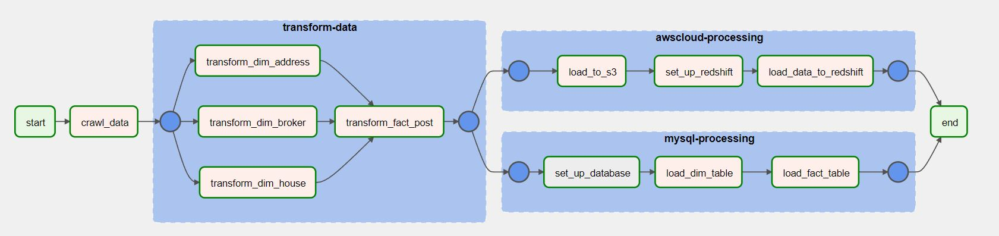
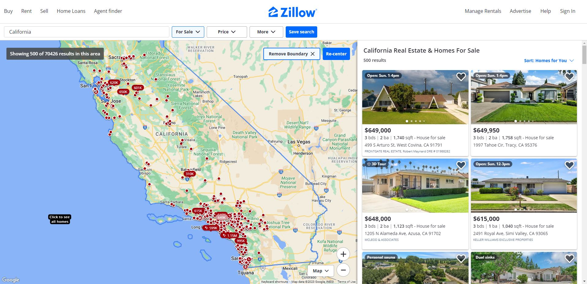
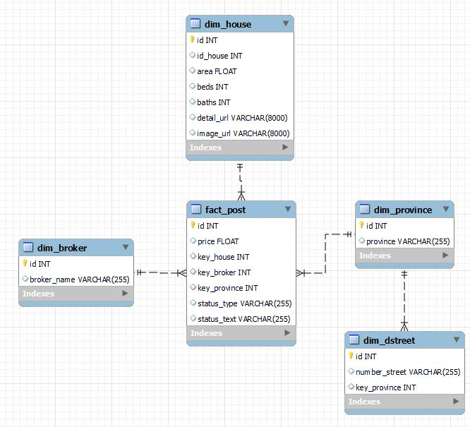
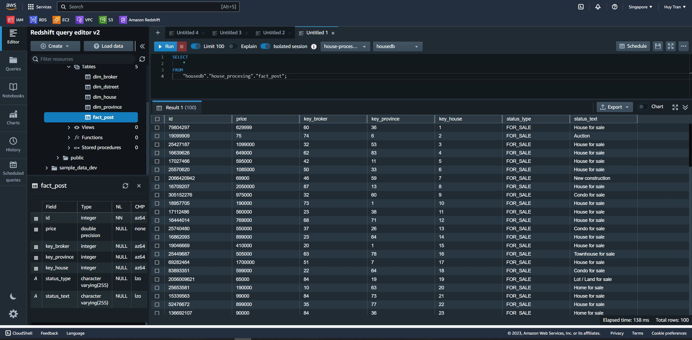
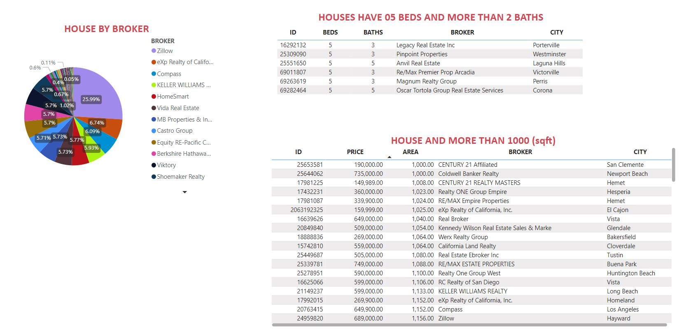

# BUILDING ETL PROCESS WITH DATA ABOUT HOUSES AND APARTMENTS IN CALIFORNIA


## 1. OVERVIEW
- Demo video: https://youtu.be/HWL2wHjZMbQ
        
 
 
- Crawling: Data about houses and apartments is extracted from the website www.zillow.com using spiders built with the Scrapy library.

 
 
- Transform Data: Raw data collected through scraping needs to undergo transformation for cleansing before being loaded into the data warehouse.
- Load Data: Designing Dimension and Fact tables to cater to analytical requirements. Specifically, the data is loaded into MySQL and then transferred to S3 - AWS Redshift.





- Visualize Data: Establishing a connection to Redshift to retrieve data and creating basic reports.
  


## 2. SKILLS AND TOOLS
- The ETL process is executed using Tasks and TaskGroup in Apache Airflow
- Data Warehouse: MySQL, AWS Redshift
- Libraries, Tools, other: Scrapy, Pandas, Docker, Python, Ms PowerBI

## 3. SOURCECODE STRUCTURE

```
|   .env
|   docker-compose.yaml
|   README.md
+---crawling
|   |   run_spider.py
|   |   scrapy.cfg
|   \---zillow
|       |   items.py
|       |   middlewares.py
|       |   pipelines.py
|       |   settings.py
|       |   utils.py
|       |   __init__.py
|       \---spiders
|           |   zillow_house.py
|           |   __init__.py
|           |
|           \---__pycache__
|                   zillow_house.cpython-310.pyc
|                   zillow_house.cpython-37.pyc
|                   __init__.cpython-310.pyc
|                   __init__.cpython-37.pyc
+---dags
|   |   houses_processing.py
|   \---group_task
|       |   cloud_tasks.py
|       |   mysql_tasks.py
|       |   transform_tasks.py
|       |
|       \---__pycache__
|               cloud_tasks.cpython-37.pyc
|               mysql_tasks.cpython-37.pyc
|               transform_tasks.cpython-37.pyc
+---data_stage_1
|       california_houses.json
+---data_stage_2
|       dim_broker.csv
|       dim_dstreet.csv
|       dim_house.csv
|       dim_province.csv
|       fact_post.csv
+---data_transform
|       transform.py
|       transform_dim_address.py
|       transform_dim_broker.py
|       transform_dim_house.py
|       transform_fact_post.py
+---logs
+---mysql_utils
|       load_dim_table.py
|       load_fact_table.py
|       set_up_database.sql
+---plugins
\---redshift_utils
        aws_infor.py
        load_local_to_s3.py
        load_s3_to_redshift.py
        set_up_database.sql
```

- The "crawling" directory contains all the source code for scraping data from the website. Raw data is saved in JSON format in the "data_stage_1" directory.
- Data transformation operations are located within the "data_transform" directory. After transformation, the data is saved in CSV format in the "data_stage_2" directory.
- Connection setup and data loading files for MySQL are located within the "mysql_utils" directory.
- Connection setup and data loading files for Amazon Redshift are located in the "redshift_utils" directory.
- The "docker-compose.yaml" file configures containers and services.
